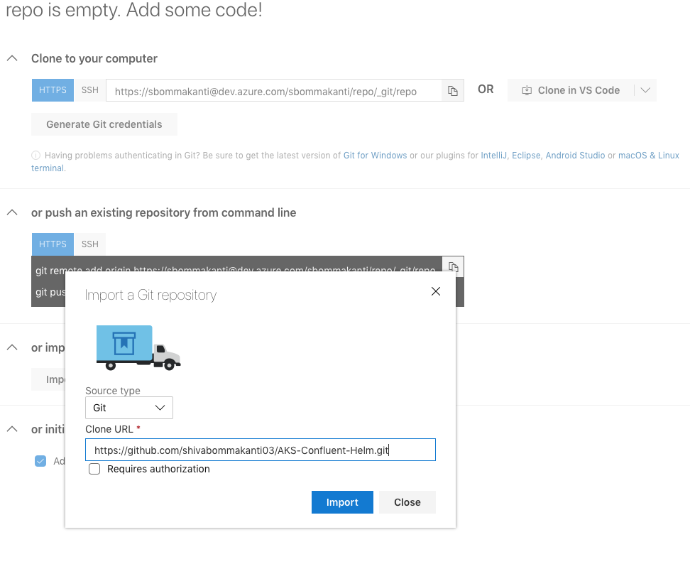
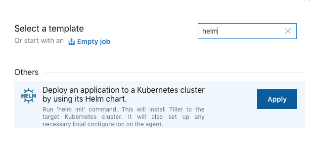
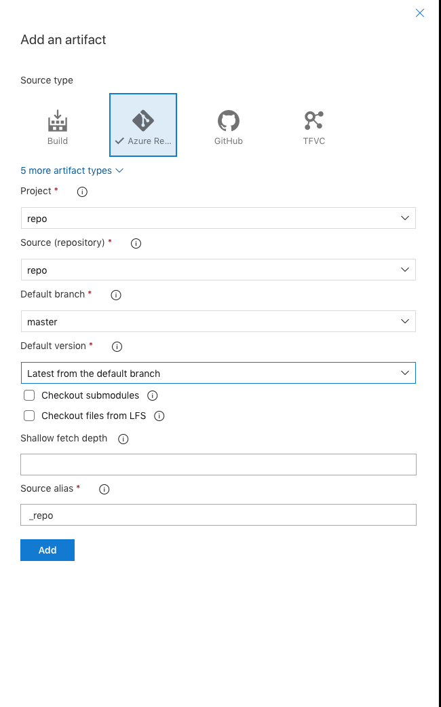
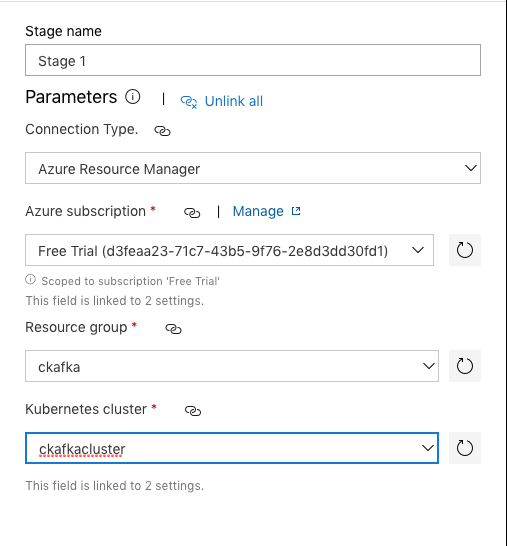
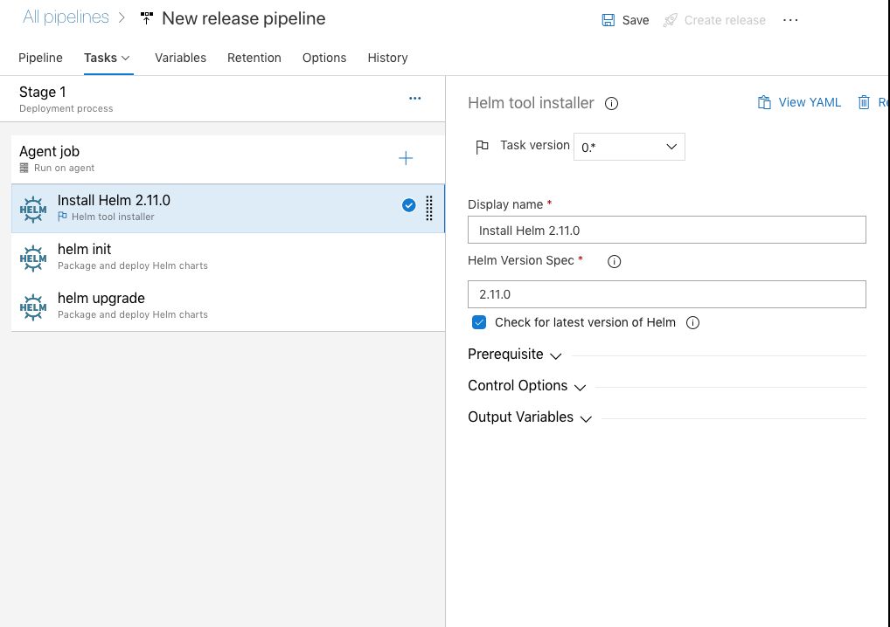
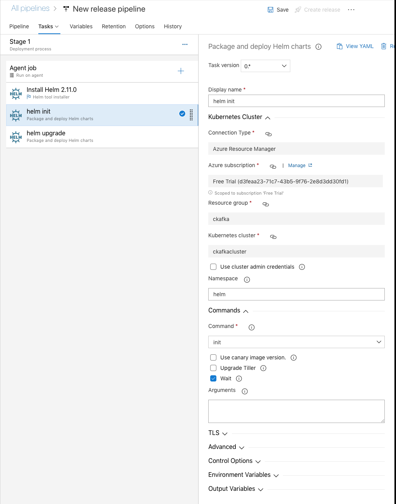
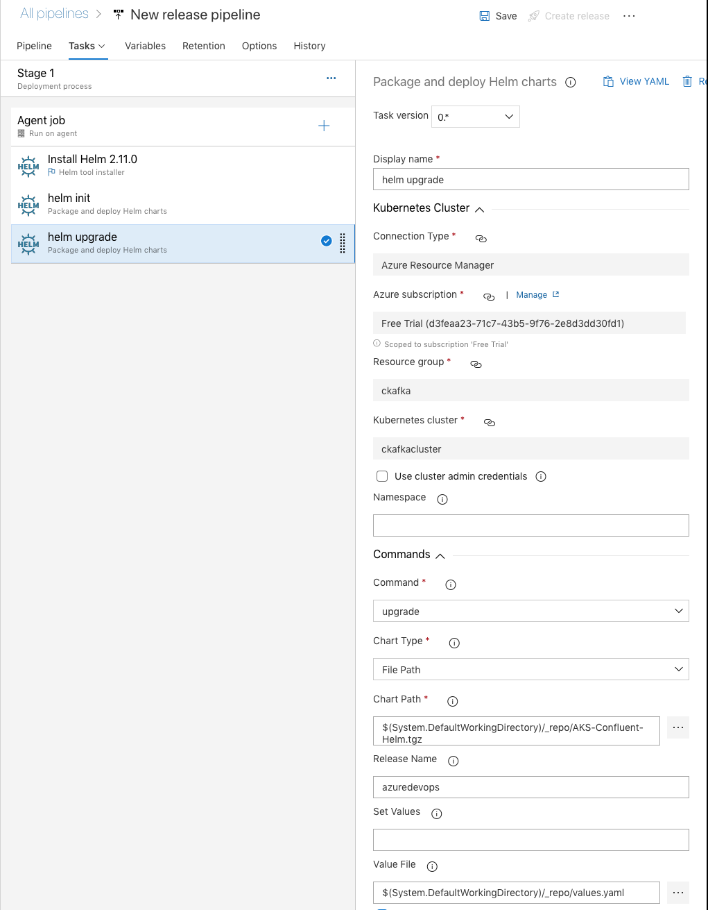

## Installing Confluent Kafka with Monitoring using Helm charts on AKS using Azure DevOps

## Pre-Requisites
  1. Active Azure subscription
  2. Azure-CLI installed or access to Azure portal
  3. Zipped chart.yaml files

## Azure-CLI Steps: Ref [https://docs.microsoft.com/en-us/azure/aks/tutorial-kubernetes-deploy-cluster]
  1. Create a resource group for your AKS to use it 
    ` az group create --name <Name of Your ResourceGroup> --location <Location> `
  2. Now, Install your Kubernetes cluster with mentioning how many nodes you want and specifying the version you want to use.     ` az aks create --resource-group <Your ResourceGroup> --name <Kubernetes-Cluster Name> --node-count <Number> --kubernetes-version <Version> `
  3. Install Kubernetes CLI on your local so you can connect to your cluster 
    ` az aks install-cli `
  4. Create tiller account on your default kubernetes cluster and give cluster permissions  
    ` kubectl -n kube-system create sa tiller `
    ` kubectl create clusterrolebinding tiller --clusterrole cluster-admin --serviceaccount=kube-system:tiller`
  5. Give deault account cluster permissions.
    ` kubectl create clusterrolebinding default --clusterrole cluster-admin --serviceaccount=kube-system:default`
  6. Create a Namespace in your cluster.
    ` kubectl create ns <Your NameSpcae>`
  
## Creatting your Azure Devops Release pipeline
  1. Navigate to your Azure Devops portal [https://dev.azure.com] and create new project for the release.
  2. Navigate to Repos on left panel and click on Repos and click on import repo and import repo. 
  
  
  
  3. Once the repo imported successfully, navigate to pipeline and select releases --> new pipeline
  4. Select the replate of Deploy an application to a Kubernetes cluster by using its Helm chart. 
  
  
  
  
  5. Close the window and select Artifact and in Artifact select Azure repo which has your code.
  
  
  6. Now,Navigate to Stage1 where it says 1job,3tasks.
  
  7. Select Connection type as Azure Resource Manager (ARM) and authorize it with your subscription
  
  
  
  
  8.Navigate to task1 i.e Helm install and choose the version of Helm you want to install (By default it will install 2.9.0)
  
  
  
  9. Now, Choose Helm init task and choose your namespace which you created.
  
  
  
  10. Move on to Helm upgrade task and choose your Namespace, tgz file which contains all of your charts and values.yaml file.
  
  
  
  11. Change your release pipeline name to reflect the release name in your Helm upgrade template.
  12. Click on save and then create release.
 
 

  
